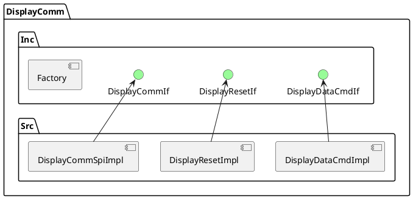

# Display Comm

Library for communication with display.

```plantuml

@startuml

package "DisplayComm" {
    package "Inc" {
        () DisplayCommIf #palegreen
        () DisplayResetIf #palegreen
        () DisplayDataCmdIf #palegreen

        [Factory]
    }

    package "Src" {
        [DisplayCommSpiImpl]
        [DisplayResetImpl]
        [DisplayDataCmdImpl]

        DisplayCommSpiImpl -u-> DisplayCommIf
        DisplayResetImpl -u-> DisplayResetIf
        DisplayDataCmdImpl -u-> DisplayDataCmdIf
    }
}

@enduml

```
