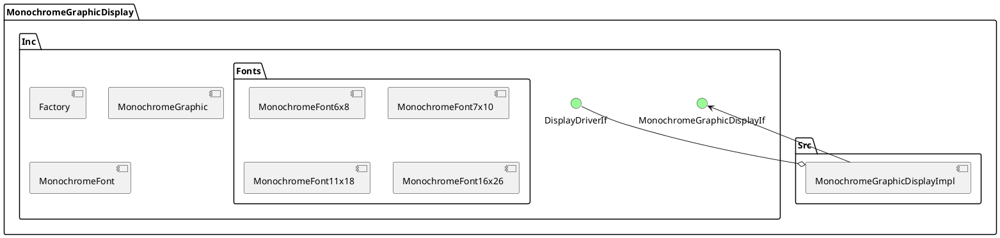

# Monochrome Graphic Display component

```plantuml

@startuml

package "MonochromeGraphicDisplay" {
    package "Inc" {
        () DisplayDriverIf #palegreen
        () MonochromeGraphicDisplayIf #palegreen

        [Factory]
        [MonochromeGraphic]
        [MonochromeFont]

        package "Fonts" {
            [MonochromeFont6x8]
            [MonochromeFont7x10]
            [MonochromeFont11x18]
            [MonochromeFont16x26]
        }
    }

    package "Src" {
        [MonochromeGraphicDisplayImpl]

        MonochromeGraphicDisplayImpl -u-> MonochromeGraphicDisplayIf
        MonochromeGraphicDisplayImpl o-u- DisplayDriverIf
    }
}

@enduml

```
