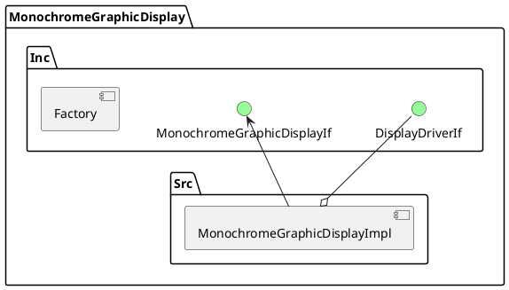

# Monochrome Graphic Display component

```plantuml

@startuml

package "MonochromeGraphicDisplay" {
    package "Inc" {
        () DisplayDriverIf #palegreen
        () MonochromeGraphicDisplayIf #palegreen

        [Factory]
    }

    package "Src" {
        [MonochromeGraphicDisplayImpl]

        MonochromeGraphicDisplayImpl --> MonochromeGraphicDisplayIf
        MonochromeGraphicDisplayImpl o-u- DisplayDriverIf
    }
}

@enduml

```
