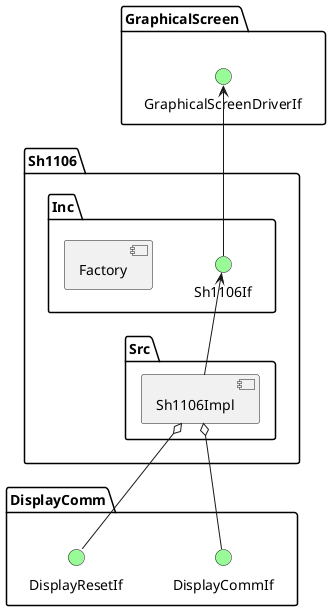

# Driver for SH1106

Library for driving display with SH1106 driver.

```plantuml

@startuml

package "DisplayComm" {
    () DisplayCommIf #palegreen
    () DisplayResetIf #palegreen
}

package "GraphicalScreen" {
    () GraphicalScreenDriverIf #palegreen
}

package "Sh1106" {
    package "Inc" {
        () Sh1106If #palegreen

        [Factory]

        Sh1106If -u-> GraphicalScreenDriverIf
    }

    package "Src" {
        [Sh1106Impl]

        Sh1106Impl -u-> Sh1106If
        Sh1106Impl o-- DisplayCommIf
        Sh1106Impl o-- DisplayResetIf
    } 
}

@enduml


```
