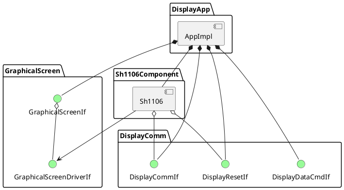

# Aplikacja obsługująca wyświetlacz OLED ze sterownikiem SH1106

Library for driving display with SH1106 driver.

Init -> Sh1106
setCommInterface -> Sh1106()
setDisplayOn -> Sh1106
setColorInverted -> Sh1106
setContrast 
updateScreen

Graphical Screen:
fill
clear
drawPixel
drawLine
writeChar
writeString
displayPhoto
